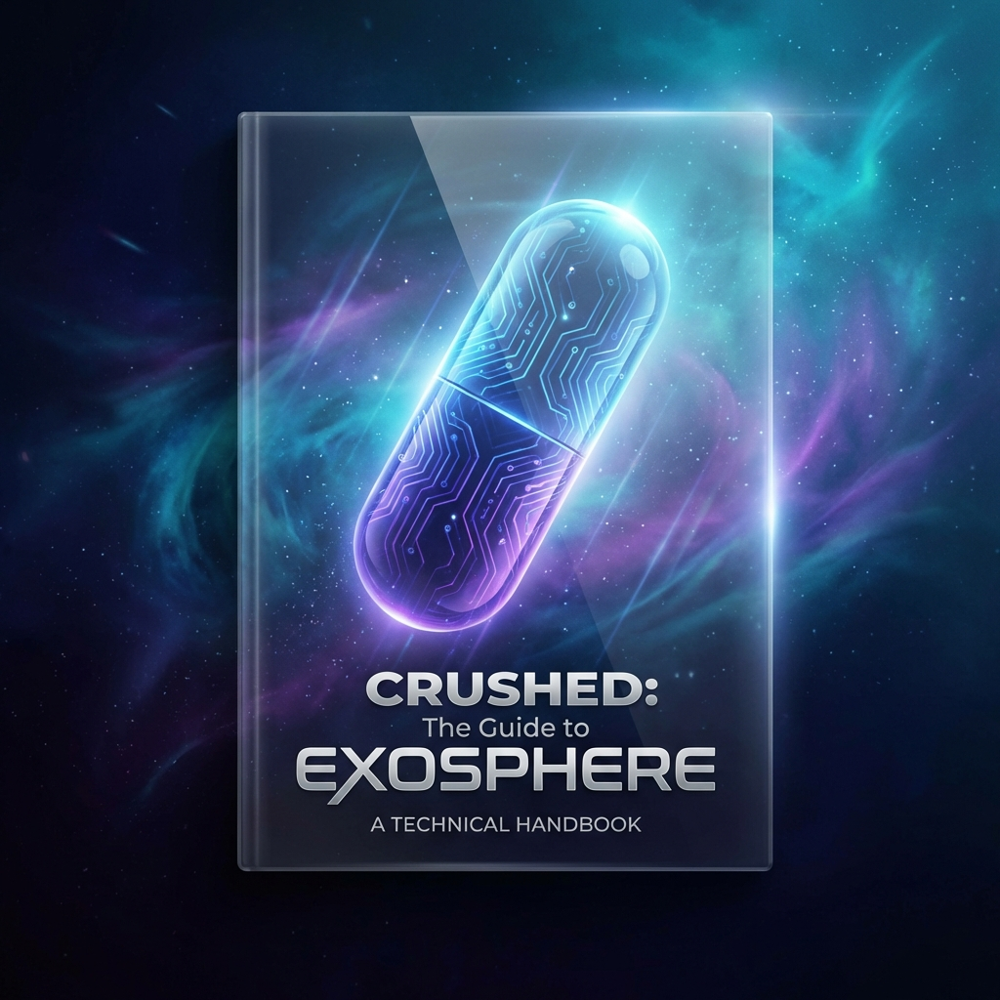
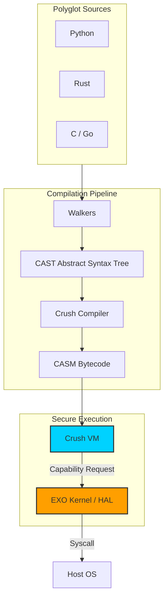

# Crushed: The Guide to Exosphere



**A polyglot Virtual Operating System (vOS) with capability-based security**

Crush acts as a **virtual operating system** that expands and uplifts the host kernel, enabling code from multiple programming languages (Python, Rust, C, Go, Bash) to run in a single, secure execution environment with memory safety guarantees and fine-grained permission control.

## Features

- 🌐 **Polyglot Execution**: Compile and run Python, Rust, C, Go, and Bash code
- 🐚 **Interactive Shell**: Full REPL with standard shell syntax (`ls`, `git`) and scripting
- 🔒 **Capability-Based Security**: Sandboxed access to I/O, filesystem, and network
- 📦 **Capsule Isolation**: Per-capsule Virtual File System (VFS) and scoped resource handles
- 📜 **Permission Manifests**: Declare and enforce required capabilities at runtime
- 🧠 **Memory Safety**: Arena-based memory management with runtime borrow checking
- ⚡ **Control Flow**: Full support for if/else, while loops, and comparisons
- 🔧 **Extensible**: Modular architecture with `crush-shell` and `crush-stdlib`

## Quick Start

### Installation

```bash
# Clone the repository
git clone https://github.com/crush-dev/crush.git
cd crush

# Build the project
cargo build --release

# Add to PATH
export PATH="$PWD/target/release:$PATH"
```

### Interactive Shell

Run `crush` to enter the interactive shell. It supports standard shell commands and Crush scripting.

```bash
$ crush
Crush Interactive REPL
Type ':help' for assistance or 'exit' to quit.
crush (crush)> echo "Hello World"
=> Hello World
crush (crush)> ls -la
... (file listing) ...
crush (crush)> :set lang python
crush (python)> print("Hello from Python")
=> Hello from Python
```

### Running Scripts

Create `hello.py`:
```python
print("Hello from Crush!")
```

Compile and run:
```bash
exo compile hello.py
exo run hello.py.casm.json
```

### Platforms


## Architecture



### Compilation Pipeline

1. **Source → CAST**: Language-specific walkers translate source code to Crush AST
2. **CAST → CASM**: Crush compiler generates bytecode with control flow compilation
3. **CASM → Execution**: VM executes bytecode with permission enforcement

## Capabilities

<div align="center">
  
</div>

Crush provides sandboxed access to host resources through capabilities:

| Capability | Description | Permission |
|------------|-------------|------------|
| `io.print` | Print to stdout | `io.print` |
| `io.input` | Read from stdin | `io.input` |
| `fs.read` | Read files | `fs.read` |
| `fs.write` | Write files | `fs.write` |
| `net.http_get` | HTTP GET requests | `net.http_get` |
| `ffi.call` | Call native functions | `ffi.call` |

### Permission Manifests

Programs declare required capabilities in their manifest:

```json
{
  "manifest": {
    "permissions": ["io.print", "fs.read"]
  }
}
```

The VM enforces these permissions at runtime, denying unauthorized capability calls.

## Examples

### Filesystem Access

```python
# Write to file
__crush_call__("fs.write", "output.txt", "Hello, World!")

# Read from file
content = __crush_call__("fs.read", "output.txt")
print(content)
```

### Network Request

```python
html = __crush_call__("net.http_get", "http://example.com")
print(html)
```

### FFI (Foreign Function Interface)

```python
# Call native C function
result = __crush_call__("ffi.call", "libc.so.6", "strlen", "hello")
print(result)  # 5
```

## Documentation

- **[CAST Specification](languages/cast-spec.md)**: Formal definition of Crush AST
- **[Getting Started](docs/GETTING_STARTED.md)**: Detailed tutorial
- **[API Documentation](https://docs.rs/crush-vm)**: Rustdoc for all crates
- **[Architecture](docs/ARCHITECTURE.md)**: Design and implementation details

## Project Structure

```
crush/
├── crush-shell/       # Interactive shell logic (embeddable)
├── crush-cli/         # CLI entry point
├── crush-vm/          # Virtual machine implementation
├── crush-stdlib/      # Standard library capabilities (FS, IO, System)
├── crush-core/        # Shared types and IPC
├── kernel/            # Exo-kernel with capability implementations
├── languages/
│   ├── casm/          # CASM bytecode format
│   ├── python_walker/ # Python → CAST translator
│   ├── rust_walker/   # Rust → CAST translator
│   ├── c_walker/      # C → CAST translator
│   ├── go_walker/     # Go → CAST translator
│   └── crush_compiler/# CAST → CASM compiler
├── examples/          # Example programs
└── docs/              # Documentation
```

## Development

### Running Tests

```bash
cargo test --workspace
```

### Building Documentation

```bash
cargo doc --workspace --open
```

### Adding a New Language Walker

See [CONTRIBUTING.md](docs/CONTRIBUTING.md) for a guide on adding new language support.

## Roadmap

- [x] Polyglot compilation pipeline
- [x] Memory arena with borrow checking
- [x] Permission manifests
- [x] Control flow (if/while)
- [x] Comparison and bitwise operators
- [x] Process isolation (IPC-based Capsule/HAL isolation)
- [ ] For loops and iterators
- [ ] Classes and structs
- [ ] Exception handling
- [ ] Concurrency primitives

## License

MIT License - see [LICENSE](LICENSE) for details.

## Contributing

Contributions are welcome! Please see [CONTRIBUTING.md](docs/CONTRIBUTING.md) for guidelines.

## Acknowledgments

Inspired by:
- **WebAssembly**: Portable bytecode format
- **Rust**: Memory safety without garbage collection
- **Capability-based security**: Principle of least privilege
