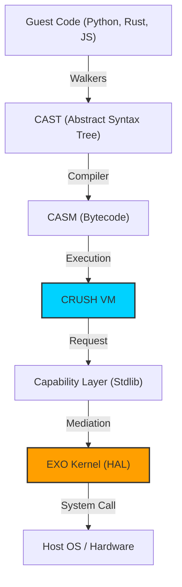
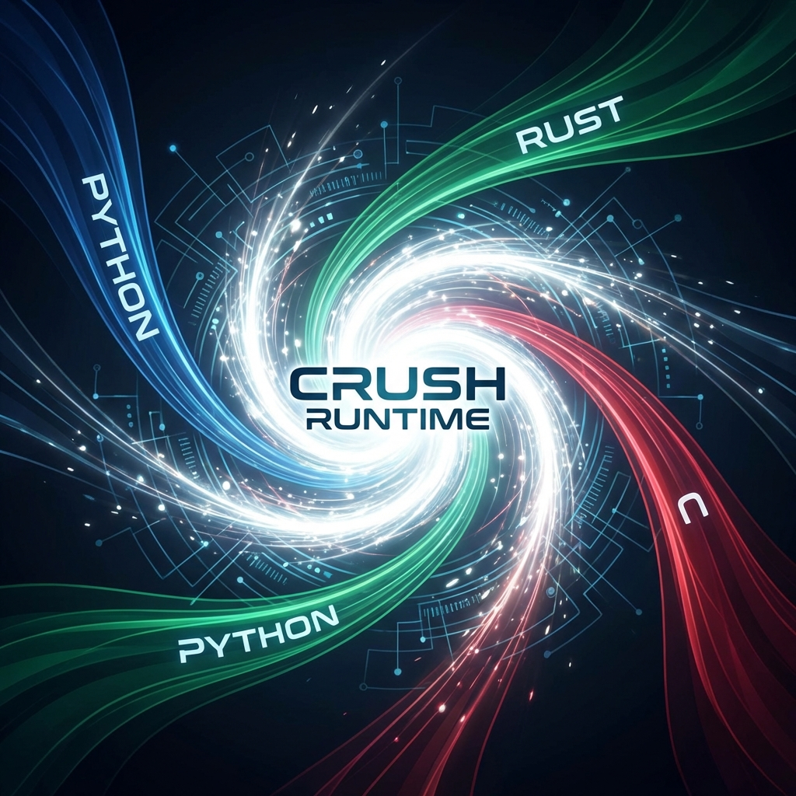

# Architecture & Design

The Exosphere architecture is a layered "Cyber-Tech" stack built for deterministic isolation and polyglot flexibility.

## Layered Hierarchy

---

## 🏗️ Core Components

### 1. Language Walkers
Walkers are the entry point. They use **Tree-Sitter** to parse native source code and translate it into **CAST** (Crush Abstract Syntax Tree). This allows Exosphere to support any language without a custom compiler for each.

### 2. CRUSH Compiler
The compiler takes the high-level CAST and lowers it into **CASM** instructions. It handles complex control flow, memory allocation strategies, and capability mapping.

### 3. CRUSH VM
The Heart of the system. The VM is a stack-based executor that enforces the **EXO Core Contract**. It provides:
- **Deterministic Execution**: Gas-measured instructions.
- **Memory Safety**: Arena-based allocation with runtime guarding.
- **Capability Isolation**: The VM cannot touch the host directly; it only communicates through the Scoped HAL.

### 4. EXO Kernel (HAL)
The Exosphere Kernel (EXO) is the "Secure Mediator." It provides the **Hardware Abstraction Layer (HAL)**.
- **Native HAL**: Direct OS access (for the host).
- **Scoped HAL**: A virtualized wrapper that provides each capsule with a private view (VFS, Handle Registry).

---

## 🌀 The Polyglot Vortex
The revolutionary aspect of this architecture is the **Unified Runtime**. Whether you write in Rust or Python, your code eventually becomes the same CASM instructions, running in the same VM, protected by the same security model.

This convergence allows for "Zero-Trust Polyglotism"—the ability to run untrusted code from any language with the same performance and security characteristics.
