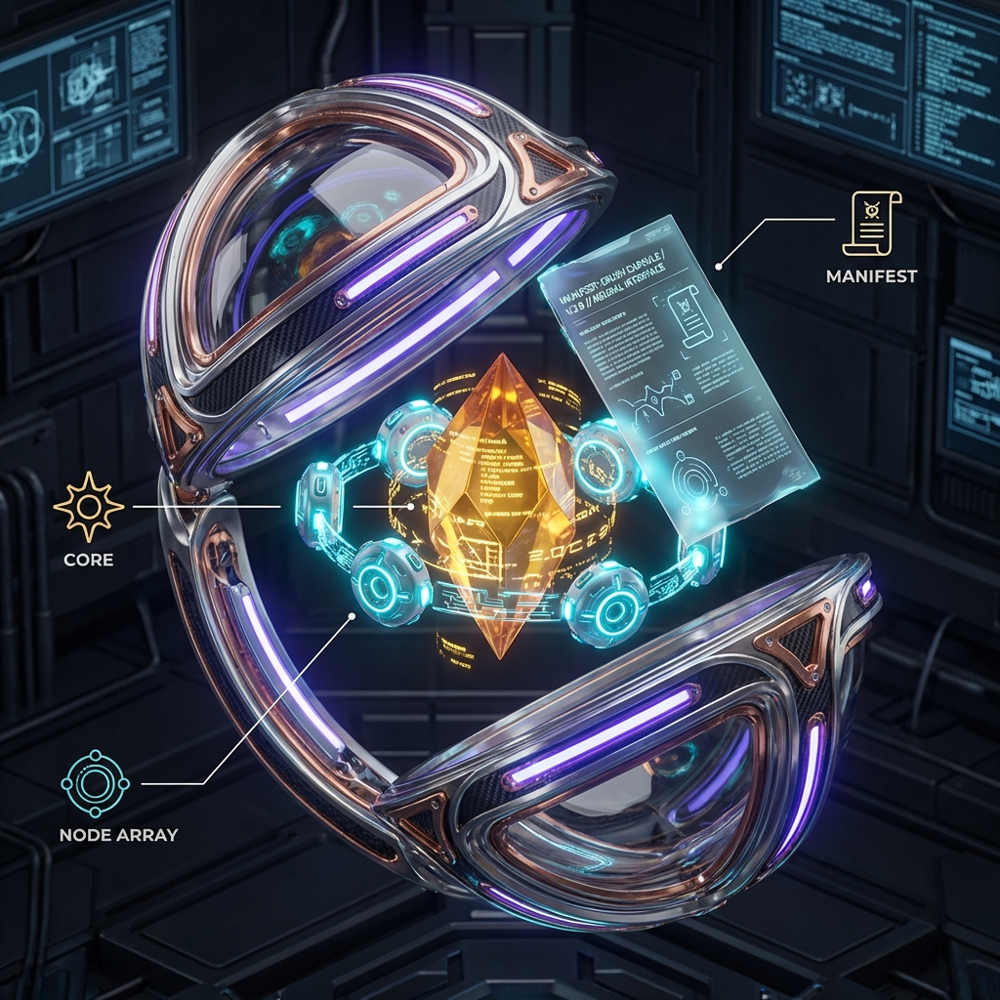
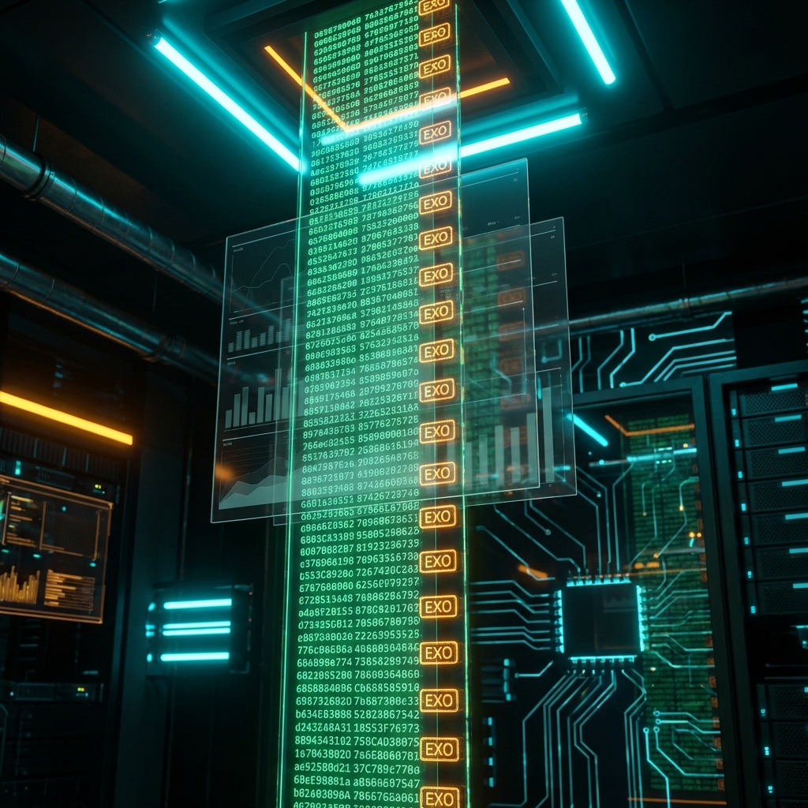
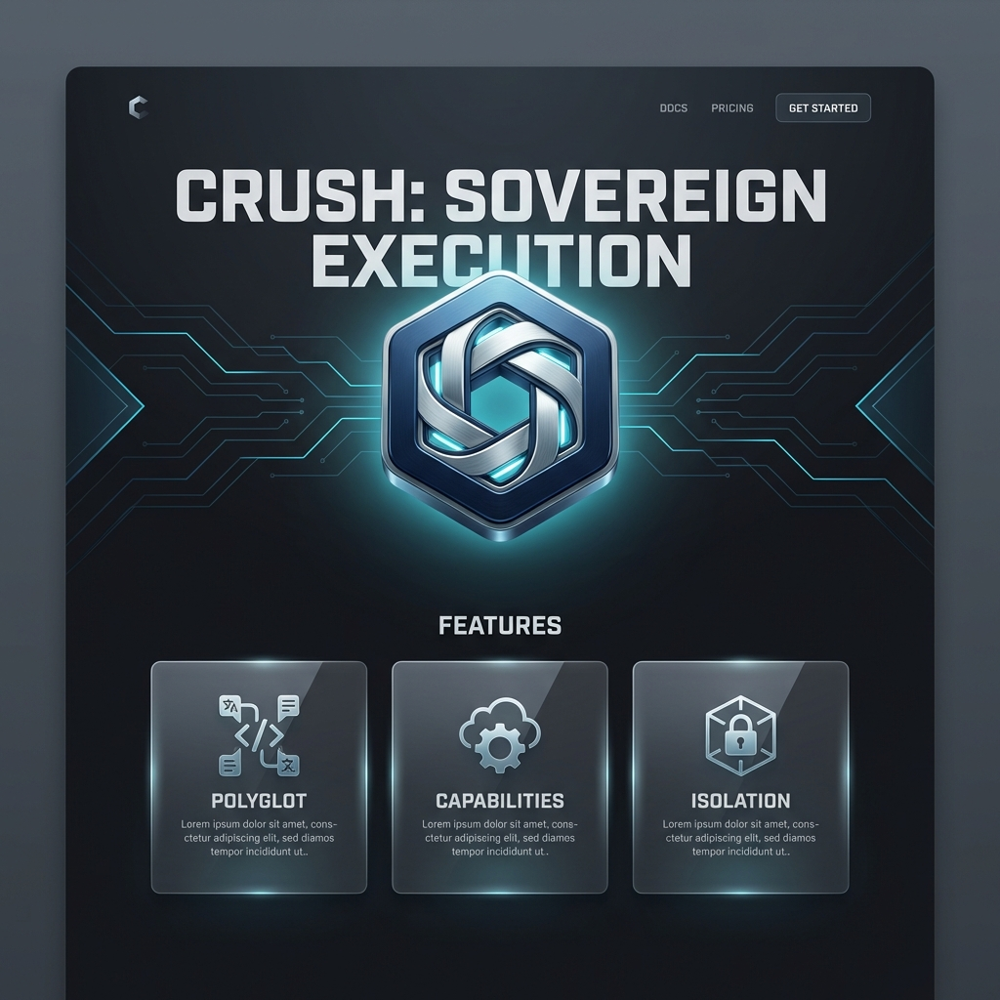

# CRUSH Visual Identity & Branding Showcase

This document serves as the high-fidelity visual guide for the CRUSH platform. It brings together the core logos, ASCII art, and the newly generated file type identity system.

---

## 1. Core Brand Identity

The CRUSH brand centers on **Isolation, Capability, and Execution**. The visual language uses futuristic "Cyber-Tech" aesthetics, emphasizing high-contrast neon glows, translucent glassmorphism, and isometric structural metaphors.

### Primary Logo (v2)
The improved CRUSH logo represents the VM boundary (Hexagon), the granted authority (Capability Nodes), and the isolated execution unit (Central Cube) with enhanced depth and glassmorphism.


### EXO Logo (Exosphere)
The foundational logo for the EXO kernel, representing the core architectural layers, the exosphere boundary, and the hardware abstraction ring.


 
### Teddy IDE Logo
The visual identity for `teddy`, the terminal-native IDE. It features a futuristic robotic bear head, symbolizing a "cozy but powerful" developer experience.


 
### Vortex Shell Logo
The visual identity for the `vortex` interactive environment. It depicts a swirling energy vortex contained within a secure hexagonal field, symbolizing the convergence of multiple languages into the CRUSH runtime.


### Packman Logo (Capsule Manager)
The visual identity for `packman`, representing the orchestrated assembly and management of capsules. It features a high-precision robotic arm handling a secure capsule.


 
### Platform Architecture (Visual Stack)
A high-fidelity representation of the CRUSH ecosystem, showing the flow from Applications down through the VM and EXO Kernel to the HAL.


### Capsule Anatomy (3D Cutaway)
A detailed breakdown of a single execution unit. It reveals the inner bytecode core, the capability-port array, and the cryptographic manifest that governs the unit's authority.



### Cryptographic Audit Ledger
The visual representation of the refined audit trail system. It depicts high-speed, EXO-stamped holographic data streams that provide immutable proof of all capability invocations.



### CRUSH Verified Seal
A holographic certificate used to denote capsules that have passed official security auditing and capability compliance. See the [Verified Program Guide](../guides/CRUSH_VERIFIED_PROGRAM.md) for requirements.


### Logo Variations
Adaptations for different backgrounds and use cases.


---

## 2. Design Tokens

### Color Palette
| **Boundary** | `@exo-cyan` | `#00D2FF` |
| **Kernel Core** | `@exo-amber` | `#FF9F00` |
| **Polyglot Logic** | `@exo-indigo` | `#6B46C1` |
| **Capability OK** | `@exo-green` | `#48BB78` |
| **Breach/Lock** | `@exo-red` | `#E53E3E` |
| **Primary Data** | `@exo-white` | `#EDF2F7` |

### Typography
- **Headlines**: *Outfit* or *Inter* (Semi-bold to Bold)
- **Monospace**: *JetBrains Mono* or *Fira Code*

---

## 3. High-Fidelity File Type Identity

Each file type in the CRUSH ecosystem has a distinct visual metaphor and color-coded identity. These icons are used in developer tools (like **TEDDY IDE**), marketplace listings, and system explorers.

### [📦] .cap (Capsule Package)
**Metaphor**: The Contained Execution Unit.
**Description**: A sleek, medical-grade capsule made of glowing green glass, housing the core bytecode cube.


### [🔒] .ecap (Encrypted Capsule)
**Metaphor**: The Proprietary Fortress.
**Description**: A reinforced, red-glowing capsule secured with laser chains and a master cryptographic lock.


### [⚙️] .casm (CRUSH Assembly)
**Metaphor**: The Deterministic Instruction Set.
**Description**: An indigo glass hexagon with cyan circuit traces and precisely stacked horizontal instruction layers.


### [🌿] .cast (Abstract Syntax Tree)
**Metaphor**: The Semantic Blueprint.
**Description**: A teal glowing branching tree structure encased in a minimal glass cube, representing language-agnostic intent.


### [📄] .crush (Manifest)
**Metaphor**: The Trusted Social Contract.
**Description**: A blue digital parchment featuring a holographic shield, declaring capability requirements and configuration.


---

## 4. Terminal Branding (ASCII)

For non-graphical environments, CRUSH maintains its identity through structured ASCII art and ANSI color codes.

```text
            .─────.
           /       \
          o  ┌───┐   o
             │[#]│
          o  └───┘   o
           \       /
            '─────'

         C R U S H
```

*See [logo-ascii.md](logo-ascii.md) for full implementation details and ANSI variants.*

---

## 5. Official Terminal Themes

The **Exosphere Dark** design system is extended to the terminal environment through official color profiles. These themes anchor the developer experience in a unified "Crush Dark" aesthetic.

### Available Profiles:
*   [**Alacritty**](themes/exosphere_alacritty.toml)
*   [**Kitty**](themes/exosphere_kitty.conf)
*   [**iTerm2**](themes/exosphere_iterm.itermcolors)

### Theme Preview:
*   **Background**: `#0F172A` (Exosphere Dark)
*   **Primary Accent**: `#00D2FF` (Exosphere Cyan)
*   **Alert/Highlight**: `#FF9F00` (Exosphere Amber)

---

## 6. Project Presentation

Strategic assets designed for communicating the CRUSH vision to the community and stakeholders.

### GitHub Social Preview
A wide-format (1280x640) cinematic preview designed for GitHub repository displays and social media link sharing (OpenGraph).


### Landing Page Concept
An ultra-modern web interface mockup demonstrating how the Exosphere design system scales to high-fidelity marketing and developer advocacy.


