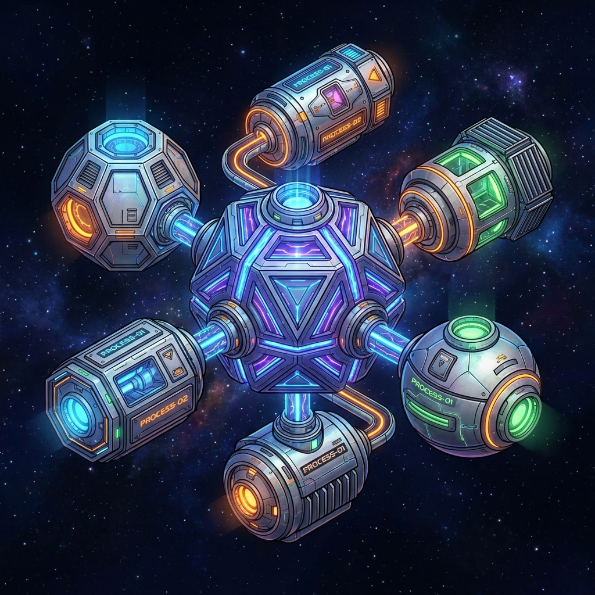

# Capsule Isolation

Crush implements strong isolation for capsules using a layered virtualization approach at the HAL (Hardware Abstraction Layer) level.

## Mechanism

When a VM is initialized with a `Manifest`, it wraps the base system HAL in a `ScopedHal`. This wrapper enforces two primary isolation boundaries:

### 1. File System Isolation (VFS)
Each capsule is assigned a unique root directory on the host (typically `~/.exo/vfs/<capsule_name>`).
- **Path Resolution**: The `Vfs` component translates virtual absolute paths (e.g., `/data/config.json`) into real host paths within the capsule's root.
- **CWD Management**: Each capsule maintains its own independent Current Working Directory within its virtual namespace.
- **Escaping Prevention**: The VFS prevents capsules from using `..` or leading `/` to access files outside their assigned root.

### 2. Handle Virtualization (`HandleRegistry`)
Raw system resource handles (memory allocations, file descriptors, network sockets) are never exposed directly to the capsule.
- **Virtual Handles**: The `ScopedHal` generates virtual `Handle` IDs (starting at 100) and registers the mapping to real host handles in a `HandleRegistry`.
- **Reference Guarding**: Any HAL operation requested by the capsule uses these virtual handles. The `ScopedHal` resolves them to real handles before calling the underlying system HAL.
- **Automatic Cleanup**: When a capsule exits, its registry is destroyed, ensuring all virtual handles are invalidated.

### 3. Environment Variable Isolation
The `ScopedHal` maintains a per-capsule environment variable map. Capsules cannot see or modify the host environment or the environment of other capsules.

## Security Properties

- **Zero-Config Isolation**: Simply running a capsule with a manifest automatically creates a sandboxed environment.
- **Fine-Grained Permissions**: The VM rejects any capability call that doesn't match the permissions declared in the capsule manifest, even before it reaches the HAL.
- **Resource Limits**: (Future) Metering is integrated into the `ScopedHal` to track and limit CPU, Memory, and I/O usage per capsule.
