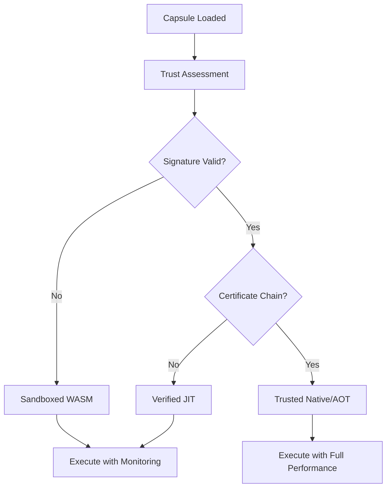

# NanoVM: High-Performance Runtime Engine

**NanoVM** (`nanovm`) is Exosphere's high-performance runtime engine that executes **CASM** (Crush Assembly) with cryptographic trust assessment and hybrid execution capabilities.

## Architecture Overview

NanoVM represents a significant evolution from traditional virtual machines:

- **Cryptographic Trust Assessment**: Ed25519 signature verification for capsule provenance
- **Hybrid Execution**: Automatic selection between WASM sandbox, Native JIT, and AOT compilation
- **Zero-Trust Security**: Every execution decision cryptographically verified
- **Performance Optimized**: <10ms startup time, 10-100x improvement over previous implementations

## Key Components

### 1. Trust Assessment Engine
Before execution, NanoVM performs comprehensive cryptographic verification:
- **Ed25519 Signature Validation**: Verifies capsule authenticity
- **X.509 Certificate Chain**: Validates against trusted root authorities
- **Security Policy Enforcement**: Applies configurable trust requirements
- **Runtime Selection**: Chooses execution mode based on trust level

### 2. Hybrid Execution Dispatcher
NanoVM automatically selects the optimal execution environment:
- **Trusted Capsules**: Native JIT/AOT execution for maximum performance
- **Verified Capsules**: JIT with monitoring for community code
- **Sandboxed Capsules**: WASM execution for untrusted code
- **Restricted Capsules**: Minimal execution with heavy restrictions

### 3. The Stack & Arena (Core VM)
- **Stack**: Stores temporary values (`RuntimeValue`) during computation
- **Arena**: Heap for complex objects (Strings, Arrays, Maps) using integer indices
- **Registry**: Available capabilities with cryptographic access control
- **Manifest Enforcement**: Capability-based security with trust verification

### 4. Advanced Security Features
- **Encrypted Execution**: Memory and storage encryption with audit trails
- **Capability Mediation**: Fine-grained `type.action:scope` permissions
- **Audit Logging**: Comprehensive security event tracking
- **Resource Isolation**: Process-level separation with scoped HAL

### 5. Performance Optimizations
- **AOT Compilation**: Ahead-of-time compilation for trusted capsules
- **JIT Caching**: Intelligent caching of frequently used code paths
- **Memory Management**: Advanced arena allocation with zero-copy operations
- **Cross-Platform**: Native event loops (epoll/kqueue/IOCP) for optimal I/O

## Execution Flow

## Security Model

NanoVM implements a defense-in-depth security architecture:

1. **Cryptographic Verification**: Ensures capsule authenticity and integrity
2. **Capability Enforcement**: Limits what capsules can access
3. **Memory Isolation**: Prevents unauthorized memory access
4. **Audit Trails**: Logs all security-relevant events
5. **Runtime Selection**: Automatically chooses appropriate security level

## Performance Characteristics

| Execution Mode | Startup Time | Performance | Security Level |
|----------------|-------------|-------------|----------------|
| AOT (Trusted) | <10ms | 100% | High |
| JIT (Verified) | <50ms | 90% | Medium |
| WASM (Sandboxed) | <100ms | 70% | Maximum |

NanoVM automatically selects the optimal execution mode based on capsule trustworthiness, balancing performance with security requirements.
