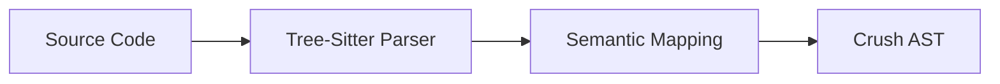

# Implementing Language Walkers

Language walkers are the components responsible for bridging the gap between host languages (Python, Rust, C, etc.) and the Crush ecosystem. They translate source code into the **Crush AST (CAST)**.

## The Walker Pipeline



All walkers are located in the `languages/` directory and leverage `tree-sitter` for high-performance, incremental parsing.

## 1. `walker-core`
The `walker-core` crate provides the foundational trait and utilities that all walkers must implement. This ensures that every walker follows the same interface and generates compatible CAST.

```rust
pub trait Walker {
    /// Translates source code into a CAST representation.
    fn walk(&self, source: &str) -> Result<CAST, WalkerError>;
}
```

## 2. Structural Requirements

A new walker crate should follow this structure:
- **`Cargo.toml`**: Include `tree-sitter`, the specific language grammar, and `walker-core`.
- **`src/lib.rs`**: Implementation of the `Walker` trait.
- **`src/visitor.rs`**: Logic for traversing the `tree-sitter` tree and generating CAST nodes.

## 3. Mapping Strategies

### Control Flow
Most languages follow similar control flow patterns. Use the generic `CAST::Block`, `CAST::If`, and `CAST::While` nodes to represent these constructs.

### Capability Injection
When a walker encounters a system call (e.g., `print()` in Python), it should map it to a `CAST::Call` targeting a capability (e.g., `@io.print`). This ensures that the code remains within the capability-based security model.

### Variables and Scoping
Walkers must handle variable declarations and scoping correctly to ensure that the Crush VM can manage lifecycle and isolation effectively.

## 4. Example Implementation

Refer to these stable implementations for guidance:
- **[Python Walker](file:///home/nixp/Projects/crush/languages/python_walker)**: Comprehensive mapping of a dynamic language.
- **[Rust Walker](file:///home/nixp/Projects/crush/languages/rust_walker)**: Focus on memory safety and explicit resource management.
- **[Bash Walker](file:///home/nixp/Projects/crush/languages/bash_walker)**: Mapping shell semantics to a structured VM.

## 5. Verification
After implementing a walker, verify it by:
1. Running the integration tests in `crush-cli`.
2. Compiling example source files to CAST and inspecting the output JSON.
3. Executing the generated CASM in the Crush VM.

## Related
- **[Polyglot Overview](../POLYGLOT_WALKERS.md)**
- **[Crush Architecture](../ARCHITECTURE.md)**
