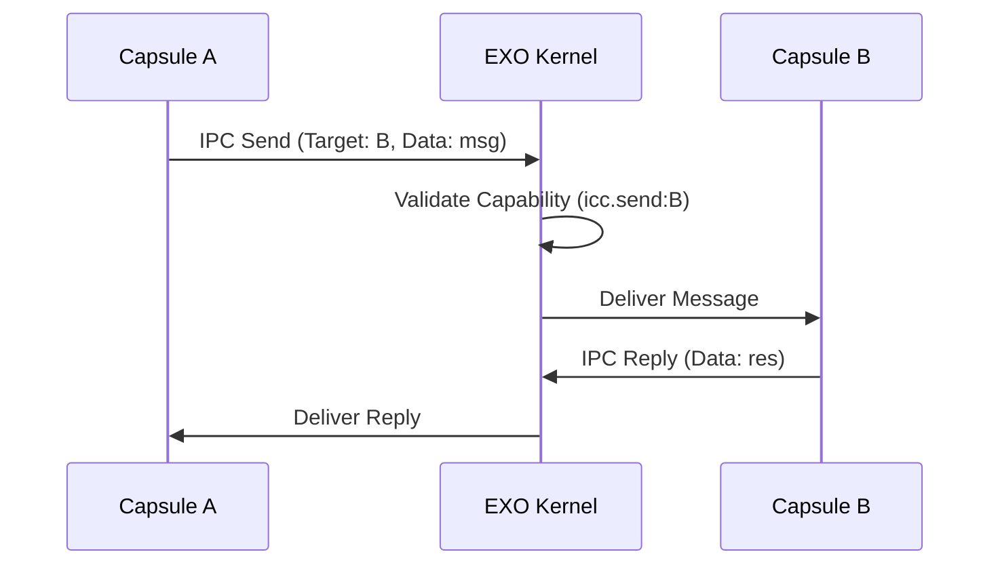

# Networking & IPC

Exosphere provides a secure, capability-gated interface for networking and Inter-Capsule Communication (IPC).

## 🌐 Network Capabilities

Unlike traditional systems where any process can open a socket, Exosphere requires explicit permission for every network action.

### 1. HTTP Capabilities
- **`net.http_get:<url_pattern>`**: Grants permission to perform a GET request to matching URLs.
- **`net.http_post:<url_pattern>`**: Grants permission to perform a POST request.

**Example Manifest:**
```json
{
  "permissions": ["net.http_get:https://api.example.com/*"]
}
```

### 2. TCP/UDP Capabilities
- **`net.tcp_connect:<host>:<port>`**
- **`net.tcp_listen:<port>`**

---

## 🔀 Inter-Capsule Communication (IPC)

The primary way capsules exchange data is through the **Secure Message Bus**.

### IPC Patterns



### 1. Simple Messaging
- **`icc.send:<target>`**: Send a non-blocking message.
- **`icc.recv`**: Receive messages from any authorized sender.

### 2. Service Discovery
Capsules can register themselves as services using the `icc.register` capability. Other capsules can then discover them by name or role.

---

## 🔒 Security Properties

- **Address Space Isolation**: Capsules cannot "sniff" or interfere with each other's network traffic.
- **Protocol enforcement**: The HAL can enforce protocol-specific rules (e.g., ensuring only HTTPS is used).
- **Traffic Metering**: (Coming Soon) Track and limit bandwidth usage per capsule.
