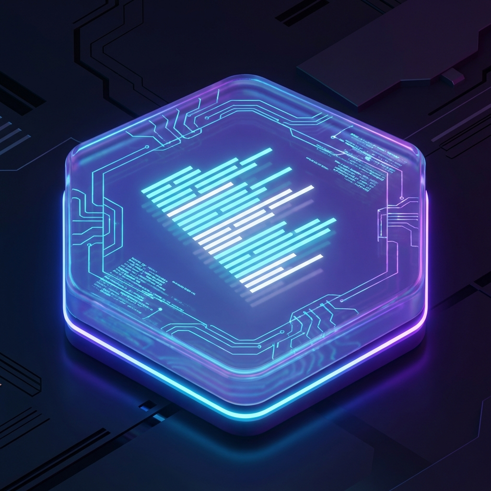
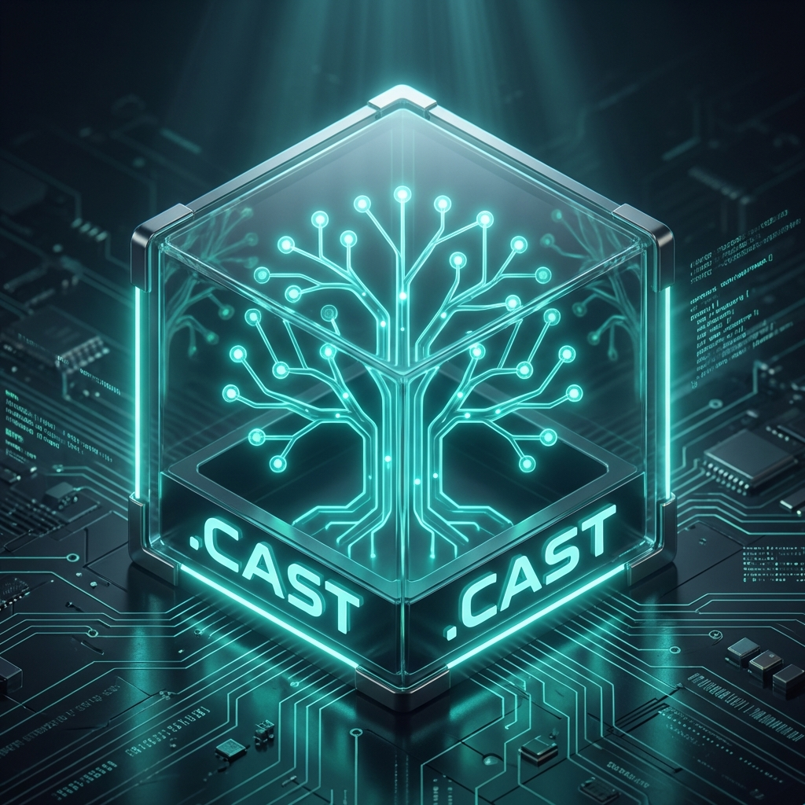
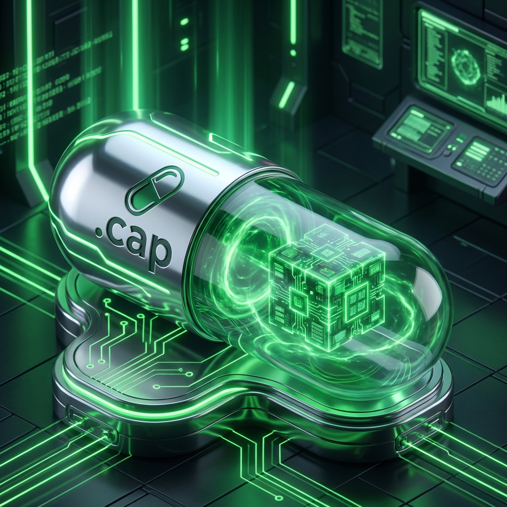
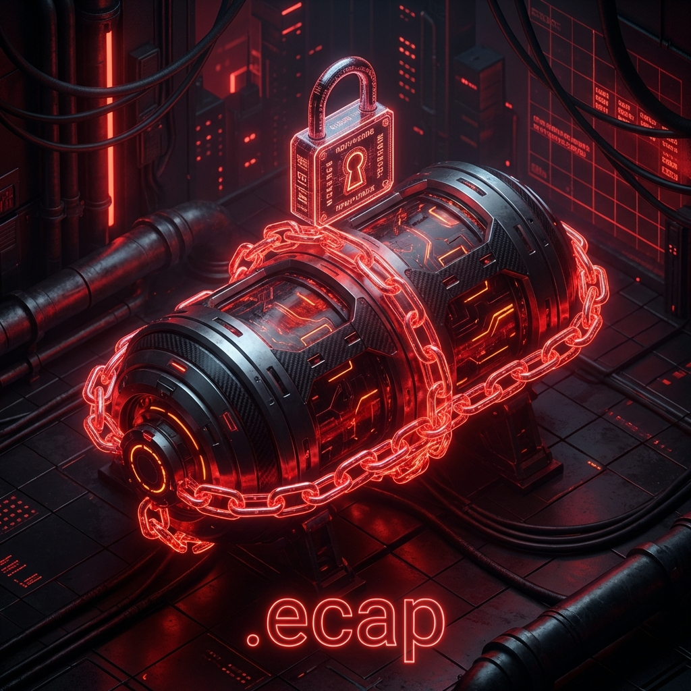

# CRUSH File Types, Formats & Visual Identity

**Status**: Draft (v1.0)
**Date**: 2026-01-18

## Table of Contents
1. [.casm - CRUSH Assembly Module](#1-casm-crush-assembly-module)
2. [.cast - CRUSH Abstract Syntax Tree](#2-cast-crush-abstract-syntax-tree)
3. [.crush - CRUSH Manifest](#3-crush-crush-manifest)
4. [.cap - Capsule Package](#4-cap-capsule-package)
5. [.ecap - Encrypted Capsule](#5-ecap-encrypted-capsule)
6. [Visual System Summary](#6-visual-system-summary)
7. [Naming Philosophy](#7-naming-philosophy)
8. [Next Extensions](#8-next-extensions-reserved)


---

## Visual Branding Showcase
A complete visual overview is available in the **[Branding Showcase](BRANDING_SHOWCASE.md)**.


## 1. `.casm` — **CRUSH Assembly Module**

### Purpose
Low-level, deterministic instruction format executed directly by the CRUSH VM.

### Characteristics
- **Format**: Binary (primary), Text (debug variant)
- **Determinism**: Strict
- **Sandboxed**: Yes
- **Gas-metered**: Yes
- **Architecture**: Stack-based + capability-aware

### Typical Use
- Compiler output (Rust, Zig, Python, SDKs)
- Hand-written core capsules
- Verified / auditable execution

### Structure (Binary)
```
[CASM_MAGIC]
[VERSION]
[INSTRUCTION_COUNT]
[CAPABILITY_TABLE_REF]
[BYTECODE...]
[CHECKSUM]
```

### Structure (Text / Debug)
```
.module math.core
.cap require fs.read net.none

push 2
push 3
add
yield
```

### Security
- Cannot perform syscalls directly
- All effects mediated via capability opcodes

### Icon / Logo Concept
- **Symbol**: Hexagon with stacked lines
- **Color**: Deep purple / indigo
- **Meaning**: Low-level, precise, deterministic



---

## 2. `.cast` — **CRUSH Abstract Syntax Tree**

### Purpose
Language-agnostic intermediate representation before CASM lowering.

### Characteristics
- **Format**: JSON / CBOR / MessagePack
- **Human-readable**: Optional
- **Not executable**

### Typical Use
- Language frontends
- Static analysis
- Auditing & verification

### Example
```json
{
  "type": "Function",
  "name": "add",
  "params": ["a", "b"],
  "body": [{"op": "Add"}]
}
```

### Security
- Pure data
- No side effects

### Icon / Logo Concept
- **Symbol**: Tree / branching nodes
- **Color**: Teal
- **Meaning**: Structure, intent, semantics



---

## 3. `.crush` — **CRUSH Manifest**

### Purpose
Declarative package and capsule description (like `Cargo.toml` / `package.json`).

### Characteristics
- **Format**: TOML or YAML
- **Signed**: Optional
- **Human-edited**

### Typical Use
- Capsule metadata
- Capability requests
- Build + runtime configuration

### Example
```toml
[name]
value = "sqlite.capsule"

[capsule]
entry = "main.casm"
type = "isolated"

[capabilities]
fs = ["/data/db"]
net = false
```

### Security
- Capability requests are reviewed & approved
- Used in policy enforcement

### Icon / Logo Concept
- **Symbol**: Document with shield
- **Color**: Blue
- **Meaning**: Trust boundary & intent


---

## 4. `.cap` — **Capsule Package**

### Purpose
Standard executable capsule bundle.

### Characteristics
- **Format**: Directory or archive (tar-like)
- **Executable**: Yes
- **Encrypted**: Optional

### Typical Use
- Application capsules
- Services
- User workloads

### Structure
```
myapp.cap/
 ├─ manifest.crush
 ├─ code.casm
 ├─ assets/
 └─ signatures/
```

### Security
- Runs in isolated VM context
- Capabilities strictly enforced

### Icon / Logo Concept
- **Symbol**: Capsule / pill
- **Color**: Green
- **Meaning**: Contained execution unit



---

## 5. `.ecap` — **Encrypted Capsule**

### Purpose
High-security capsule protected at rest and in execution.

### Characteristics
- **Format**: Encrypted `.cap`
- **Executable**: Yes (secure mode only)
- **Key-bound**: Yes

### Typical Use
- Proprietary logic
- Enterprise capsules
- Sensitive computation

### Structure
```
[ECAP_MAGIC]
[KEY_ID]
[ENCRYPTED_CAP_BLOB]
[ATTESTATION]
```

### Security
- Encrypted at rest
- Decrypted only inside encrypted VM
- Optional remote attestation

### Icon / Logo Concept
- **Symbol**: Capsule + lock
- **Color**: Red / dark orange
- **Meaning**: Confidential, protected



---

## 6. Visual System Summary

| Extension | Type | Executable | Encrypted | Icon Motif |
|--------|------|------------|-----------|-----------|
| `.casm` | Bytecode | Yes | Optional | Hex stack |
| `.cast` | IR | No | No | AST tree |
| `.crush` | Manifest | No | No | Shield doc |
| `.cap` | Package | Yes | Optional | Capsule |
| `.ecap` | Secure Package | Yes | Always | Capsule + lock |

---

## 7. Naming Philosophy

- **Short**: Unix-friendly
- **Explicit**: Security level visible in extension
- **Composable**: `.cast → .casm → .cap → .ecap`

---

## 8. Next Extensions (Reserved)

- `.cask` — Signed capability approval record
- `.cpol` — Capability policy language
- `.cvm` — Serialized VM snapshot

---

This design intentionally mirrors **ELF + WASM + OCI + capability systems**, while remaining minimal, auditable, and VM-native.

